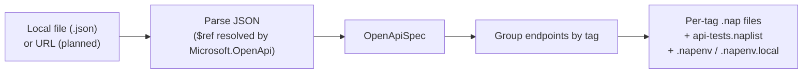
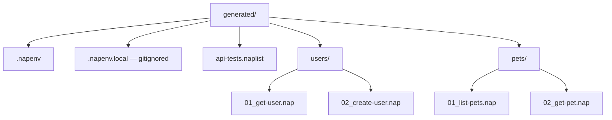

# OpenAPI Test Generation — CLI

> **One command turns an OpenAPI spec into a comprehensive, runnable test suite.** The deterministic OpenAPI → `.nap` core is F# (`OpenApiGenerator.fs`); tests verify it black-box.

---

## [OPENAPI-GENERATE] Vision

Point Nap at an OpenAPI 3.x or Swagger 2.x spec and get a complete test suite: one `.nap` per operation, organized by tag into subdirectories, with a `.naplist` playlist, a `.napenv`, and assertions derived from the spec's response schemas. The generated files are **starting points** — the user edits, extends, and commits them.

> **Status: Implemented (JSON input).** YAML ([OPENAPI-YAML]) and URL ([OPENAPI-URL]) input, error-case generation ([OPENAPI-ERROR-GEN]), and diff mode ([OPENAPI-DIFF]) are not implemented — see each section.

## [OPENAPI-FLOW] Generation flow



### [OPENAPI-INPUT] Input formats

| Format | Spec ID | Status |
|--------|---------|--------|
| OpenAPI 3.x JSON | `[OPENAPI-OAS3]` | Implemented |
| Swagger 2.x JSON | `[OPENAPI-SWAGGER2]` | Implemented |
| YAML (both versions) | `[OPENAPI-YAML]` | **Not implemented** — needs a YAML parser |
| URL-based loading (CLI) | `[OPENAPI-URL]` | **Not implemented** — file input only (the VSIX has a downloader) |

---

## What gets generated

### [OPENAPI-NAP-GEN] Per operation: a `.nap` file

```nap
# Generated from GET /users/{userId}
[meta]
name        = Get user by ID
description = Auto-generated from petstore.json - operation getUserById
tags        = ["users", "generated"]
generated   = true

[vars]
userId = "REPLACE_ME"

[request]
method = GET
url = {{baseUrl}}/users/{{userId}}

[request.headers]
Authorization = Bearer {{token}}
Accept        = application/json

[assert]
status = 200
body.id exists
body.name exists
```

### [OPENAPI-TAG-DIRS] Per tag: a subdirectory

Operations tagged `users` go into `users/`, `pets` into `pets/`; untagged operations go to the root.



### [OPENAPI-NAPLIST-GEN] Per spec: a `.naplist` playlist

A `[meta]` + `[steps]` playlist referencing every generated file, in tag/file order.

### [OPENAPI-NAPENV-GEN] Per spec: a `.napenv`

`baseUrl = <extracted>` ([OPENAPI-BASEURL]), plus a `.napenv.local` placeholder for any auth secrets ([OPENAPI-AUTH]).

---

## Generation details

### [OPENAPI-BASEURL] Base URL extraction

> **Status: Implemented.** OAS3 → first `servers[].url`; Swagger 2 → `{schemes[0]}://{host}{basePath}`; fallback `https://api.example.com`.

### [OPENAPI-PARAMS] Path parameter conversion

> **Status: Implemented.** OpenAPI `{param}` → Nap `{{param}}`; each path parameter also gets a `[vars]` entry with a `REPLACE_ME` placeholder.

### [OPENAPI-BODY-GEN] Request body generation

> **Status: Partial.** For POST/PUT/PATCH: uses the schema `example` verbatim when present, else recursively generates from the schema with type defaults. **Not yet:** `format` hints (email/uuid/date-time/uri), `enum` selection, and `minimum`/`maximum` for numerics.

### [OPENAPI-ASSERT-GEN] Response assertion generation

> **Status: Partial.** From the first 2xx response schema: `status = {code}` plus `body.{field} exists` for top-level properties. **Not yet:** `headers.Content-Type contains "json"`, and constant-value assertions for single-value enums.

### [OPENAPI-QUERY-PARAMS] Query parameter handling

> **Status: Implemented.** Query parameters are appended to the URL as `?key={{key}}` and generate matching `[vars]` entries.

### [OPENAPI-AUTH] Authentication handling

> **Status: Partial.** From `securitySchemes` + per-operation `security`:

| Scheme | Generated output | Status |
|--------|-----------------|--------|
| Bearer (`http: bearer`) | `Authorization = Bearer {{token}}` + `token` in `.napenv.local` | Implemented |
| API key (header) | `{headerName} = {{apiKey}}` + `apiKey` in `.napenv.local` | Implemented |
| Basic auth | `Authorization = Basic {{basicAuth}}` | Implemented |
| API key (query) | `?{name}={{apiKey}}` | Not implemented |

### [OPENAPI-ERROR-GEN] Error case generation

> **Status: Not implemented.**

Intended: for each documented 4xx/5xx response, generate an extra `.nap` that intentionally triggers the error (e.g. a `404` case with a nonexistent id and `status = 404`).

### [OPENAPI-REF] `$ref` resolution

> **Status: Implemented (via library).** `$ref` pointers — `#/components/schemas/...` (OAS3), `#/definitions/...` (Swagger 2), parameters, responses, and nested chains — are resolved by `Microsoft.OpenApi` during parsing before generation. There is no separate hand-rolled resolver, and no dedicated `$ref` test fixture — current generator fixtures inline their schemas.

### [OPENAPI-META-FLAG] Generated file metadata

> **Status: Implemented.** Every generated `.nap` includes `generated = true` in `[meta]`, letting tooling distinguish generated from hand-written files (enabling safe re-generation and a future [OPENAPI-DIFF]).

---

## [OPENAPI-COMMANDS] CLI commands

> **Status: Partial.** The base command is implemented; `--tag` and `--diff` are not.

```sh
napper generate openapi ./petstore.json --output-dir ./petstore/    # implemented
napper generate openapi https://api.example.com/openapi.json ...    # planned (OPENAPI-URL)
napper generate openapi ./petstore.json --tag users --tag pets ...  # planned (tag filter)
napper generate openapi ./petstore.json --output-dir ./p/ --diff    # planned (OPENAPI-DIFF)
```

### [OPENAPI-DIFF] Diff / regeneration mode

> **Status: Not implemented.**

Intended: re-running against an existing output dir with `--diff` compares the spec against previously generated files (identified by `generated = true`) and reports added/removed operations and changed schemas. Without `--diff`, re-generation overwrites `generated = true` files but leaves files where the flag has been removed (user has taken ownership).

---

## Related specs

- [File Formats](./FILE-FORMATS-SPEC.md) — the generated `.nap` / `.naplist` / `.napenv` formats
- [CLI Spec](./CLI-SPEC.md) — `[CLI-GENERATE]`
- [OpenAPI Generation (Extension)](./IDE-EXTENION-OPENAPI-GENERATION-SPEC.md) — VSIX import + AI enrichment
