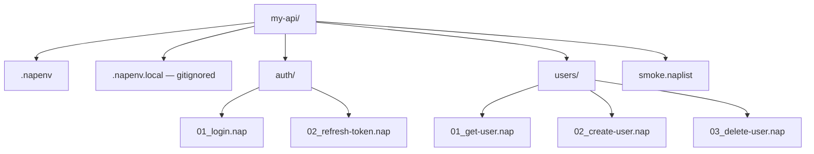

# Nap File Formats

Specifications for the `.nap`, `.napenv`, and `.naplist` file formats, shared by the CLI and every IDE extension. The parsed shapes are declared in [`Types.td`](../../src/Napper.Core/Types.td) (typeDiagram).

---

## [NAP-FILE] `.nap` request file

Each `.nap` file defines one **request** plus its optional **setup**, **assertions**, and **script reference**.

### [NAP-MINIMAL] Minimal example

```nap
GET https://api.example.com/users
```

### [NAP-FULL] Full anatomy

```nap
# Optional metadata block
[meta]
name        = "Get user by ID"
description = "Fetches a single user and asserts shape"
tags        = ["users", "smoke"]

# Optional variables (overridable by environment)
[vars]
userId = "42"

# Request block (required)
[request]
method  = GET
url     = https://api.example.com/users/{{userId}}

[request.headers]
Authorization = Bearer {{token}}
Accept        = application/json

# Optional request body (POST/PUT/PATCH)
# [request.body]
# content-type = application/json
# """
# { "name": "Alice" }
# """

# Optional built-in assertions (no scripting required)
[assert]
status  = 200
body.id = {{userId}}
body.name exists

# Optional external script for complex assertions or setup
[script]
pre  = ./scripts/auth.fsx            # runs before the request
post = ./scripts/validate-user.fsx   # runs after the response
```

The blocks, each a parsed unit:

| Block | Spec ID | Purpose |
|-------|---------|---------|
| `[meta]` | `[NAP-META]` | name, description, tags |
| `[vars]` | `[NAP-VARS]` | per-file variables (lowest precedence in [ENV-RESOLUTION]) |
| `[request]` | `[NAP-REQUEST]` | method + url (required) |
| `[request.headers]` | `[NAP-HEADERS]` | header key/value pairs |
| `[request.body]` | `[NAP-BODY]` | content-type + body (POST/PUT/PATCH) |
| `[assert]` | `[NAP-ASSERT]` | declarative assertions |
| `[script]` | `[NAP-SCRIPT]` | pre/post script references ([SCRIPT-DISPATCH](./SCRIPTING-SPEC.md)) |

### [NAP-DESIGN] Key design decisions

- **TOML-inspired syntax** — familiar, unambiguous, easy to parse.
- **`{{variable}}` interpolation** ([ENV-INTERPOLATION]) throughout — resolved from env files, CLI flags, or parent playlist scope.
- **`[assert]` block** — declarative assertions covering ~80% of cases without scripting:

  | Operator | Spec ID | Example |
  |----------|---------|---------|
  | status | `[ASSERT-STATUS]` | `status = 200` |
  | equals | `[ASSERT-EQUALS]` | `body.path = value` (JSONPath equality) |
  | exists | `[ASSERT-EXISTS]` | `body.path exists` |
  | matches | `[ASSERT-MATCHES]` | `body.path matches "pattern"` (glob) |
  | contains | `[ASSERT-CONTAINS]` | `headers.Content-Type contains "json"` |
  | less-than | `[ASSERT-LT]` | `duration < 500ms` |
  | greater-than | `[ASSERT-GT]` | `body.count > 0` |

- **`[script]` block** — references external script files for pre/post hooks in any supported language; dispatch is by extension ([SCRIPT-DISPATCH](./SCRIPTING-SPEC.md)).
- **[NAP-COMMENTS]** — comments start with `#`.

### [NAP-METHODS] Supported HTTP methods

`GET`, `POST`, `PUT`, `PATCH`, `DELETE`, `HEAD`, `OPTIONS`.

---

## [ENV-FILE] `.napenv` environment file

Environment files are TOML files defining variable sets per deployment target.

```toml
# .napenv (base — checked into git, no secrets)
baseUrl = "https://api.example.com"
userId  = "42"
```

```toml
# .napenv.local (gitignored — secrets)
token = "eyJhbGci..."
```

```toml
# .napenv.staging
baseUrl = "https://staging.api.example.com"
token   = "staging-token"
```

### [ENV-RESOLUTION] Variable resolution order (highest wins)

1. `[CLI-VAR]` — CLI `--var key=value` flags ([CLI-VAR](./CLI-SPEC.md))
2. `[ENV-LOCAL]` — `.napenv.local`
3. `[ENV-NAMED]` — named environment file (e.g. `.napenv.staging`)
4. `[ENV-BASE]` — base `.napenv`
5. `[NAP-VARS]` — `[vars]` block in the `.nap` file

### [ENV-INTERPOLATION] Variable interpolation

`{{variable}}` tokens in any `.nap`/`.naplist` value are replaced with the resolved value from [ENV-RESOLUTION]. Unresolved variables surface as diagnostics in the IDE ([LSP-DIAGNOSTICS](./LSP-SPEC.md)).

---

## [COLLECTION-FOLDER] Collections — folder-based

A folder of `.nap` files is implicitly a **collection**. Subfolders are sub-collections.



**[COLLECTION-SORT]** — execution order within a folder is **filename sort** (use numeric prefixes `01_`, `02_` to control order).

---

## [NAPLIST-FILE] `.naplist` playlist file

A `.naplist` is an explicit ordered list of steps ([NAPLIST-STEPS]). Steps reference:

- `[NAPLIST-NAP-STEP]` — individual `.nap` files (by relative path)
- `[NAPLIST-FOLDER-STEP]` — folders (run all `.nap` files in the folder, sorted)
- `[NAPLIST-NESTED]` — other `.naplist` files (fully recursive)
- `[NAPLIST-SCRIPT-STEP]` — script files in any supported language ([SCRIPT-DISPATCH](./SCRIPTING-SPEC.md))

A playlist also carries a `[NAPLIST-META]` block (`[meta]`: name, default `env`) and a `[NAPLIST-VARS]` block (`[vars]`).

```naplist
[meta]
name = "Smoke Test Suite"
env  = staging          # default environment for this playlist

[vars]
timeout = "5000"

[steps]
./auth/01_login.nap
./auth/02_refresh-token.nap
./users/01_get-user.nap
./regression/core.naplist   # nested playlist
```

### [NAPLIST-VAR-SCOPE] Variable scoping in playlists

- A `[NAPLIST-VARS]` block (`[vars]`) sets variables for all steps in that playlist.
- Scripts can use `ctx.set` ([SCRIPT-CONTEXT](./SCRIPTING-SPEC.md)) to pass variables **forward** to subsequent steps in the same playlist.
- Nested `.naplist` files ([NAPLIST-NESTED]) inherit the parent's variable scope unless they override it.

---

## Related specs

- [CLI Spec](./CLI-SPEC.md) — commands and flags
- [Scripting](./SCRIPTING-SPEC.md) — `[script]` hooks and the context protocol
- [LSP Specification](./LSP-SPEC.md) — diagnostics, completions, and hover over these formats
