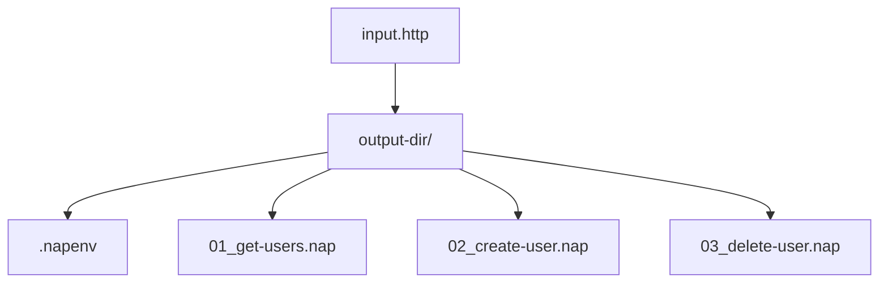
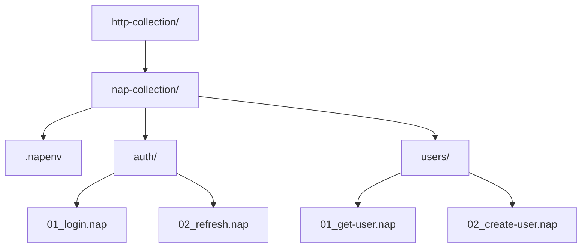

# .http File Compatibility

> **Let users bring their existing `.http` files to Nap — convert them to `.nap`, or (future) run them directly.**

---

## [HTTP-COMPAT] Goal

The `.http` format is the most widely adopted plain-text HTTP request format — supported by Visual Studio, JetBrains IDEs, and VS Code's REST Client. Nap's `.nap` format is superior for testing (declarative assertions, playlists, scripting), but asking users to abandon existing `.http` files is a migration barrier. Nap meets users where they are.

## [HTTP-PROBLEM] No single standard

There is **no single `.http` standard**. Two major dialects exist, plus a shared core.

### [HTTP-MS] Microsoft dialect

Used by Visual Studio and the VS Code REST Client. Aligned with [RFC 9110](https://www.rfc-editor.org/rfc/rfc9110) and Microsoft's tooling docs.

| Feature | Syntax |
|---------|--------|
| Request separator | `###` |
| Comments | `#` or `//` |
| Variables | `@name = value` (file-level) or `{{name}}` (interpolation) |
| Named requests | `# @name requestName` above the request line |
| Response scripting | not native |

### [HTTP-JB] JetBrains dialect

Used by IntelliJ, Rider, WebStorm, and the JetBrains HTTP Client CLI.

| Feature | Syntax |
|---------|--------|
| Request separator | `###` |
| Variables | `{{name}}` from `http-client.env.json` |
| Named requests | `### Request Name` |
| Pre-request scripts | `< ` or `< file.js` |
| Response handlers | `> ` or `> file.js` |
| Output redirection | `>>` / `>>!` |
| WebSocket / GraphQL / gRPC | `WEBSOCKET` / `GRAPHQL` / `GRPC` |

### [HTTP-SHARED] Common subset

Both dialects share this core:

```http
### Optional comment or name
METHOD URL [HTTP/version]
Header-Name: Header-Value

Request body here
```

Shared elements, each parsed: `[HTTP-SEPARATOR]` (`###`), `[HTTP-METHOD-LINE]` (`METHOD URL` first line), `[HTTP-HEADERS]` (colon-separated pairs), `[HTTP-BODY]` (blank line + content), `[HTTP-COMMENTS]` (`#` and `//`), `[HTTP-VARS]` (`{{variable}}`, same as Nap).

---

## [HTTP-APPROACH] Approach: converter first, direct-run later

After evaluating three options, the **converter** is the primary strategy:

| Option | Pros | Cons |
|--------|------|------|
| **A. Converter (`napper convert`)** | Simple, deterministic, testable; full `.nap` features after conversion | One-time migration; re-convert if `.http` changes |
| B. LSP dual-format | Seamless in-IDE | Massive complexity; two grammars; assertion gap |
| C. Runtime interpreter | `napper run file.http` just works | Must replicate JetBrains/MS scripting; lossy assertions |

The converter is the highest-value, lowest-risk path. Direct `napper run file.http` ([HTTP-RUN]) can be added later as on-the-fly conversion.

---

## [HTTP-CONVERT] Conversion specification

> **Status: Implemented** (`napper convert http`), via `DotHttp` parser + `HttpToNapConverter`.

```sh
napper convert http ./requests.http --output-dir ./nap-requests/
napper convert http ./http-collection/ --output-dir ./nap-collection/
napper convert http ./requests.http --env-file ./http-client.env.json --output-dir ./output/
napper convert http ./requests.http --dry-run
```

### [HTTP-CONVERT-FLAGS] CLI flags

| Flag | Spec ID | Status |
|------|---------|--------|
| `--output-dir <dir>` | `[HTTP-CONVERT-OUTDIR]` | Implemented |
| `--env-file <path>` | `[HTTP-CONVERT-ENVFILE]` | Implemented — `http-client.env.json` etc. |
| `--dry-run` | `[HTTP-CONVERT-DRYRUN]` | Implemented — preview without writing |
| `--dialect <ms\|jb\|auto>` | `[HTTP-CONVERT-DIALECT]` | **Not implemented** — dialect is auto-detected ([HTTP-CONVERT-DETECT]); no override flag |
| `--overwrite` | `[HTTP-CONVERT-OVERWRITE]` | **Not implemented** — existing `.nap` files are currently skipped; no flag |

### [HTTP-CONVERT-PARSE] Parsing strategy

The converter parses `.http` files with a **line-oriented state machine** (FParsec, not regex on structured data), operating on [HTTP-SHARED] with dialect extensions. States: `BeforeMethod` (consuming `###`/comments) → `InHeaders` → `InBody` (until next `###`/EOF) → `InScript`.

#### [HTTP-CONVERT-DETECT] Dialect detection

- `@variable = value` at file level → Microsoft
- `< {%` / `> {%` script blocks → JetBrains
- otherwise → common subset

### [HTTP-CONVERT-MAPPING] Format mapping

| `.http` element | `.nap` output |
|-----------------|---------------|
| `### Name` / `# @name Name` | `[meta] name = "Name"` |
| `METHOD URL` | `[request]` method + url |
| `Header: Value` | `[request.headers]` entry |
| Body content | `[request.body]` |
| `{{variable}}` | `{{variable}}` (identical) |
| `HTTP/1.1` / `HTTP/2` | dropped (Nap omits HTTP version) |
| `@var = value` (MS) | `[vars] var = "value"` |

#### [HTTP-CONVERT-ENV] Environment file conversion

> **Status: Implemented.**

JetBrains `http-client.env.json` → one `.napenv.<env>` per environment; the private env file → `.napenv.local` (with a gitignore note).

#### [HTTP-CONVERT-SCRIPTS] Script handling

> **Status: Partial.** Pre-request and response-handler scripts are detected and produce a warning + a `TODO` comment in the generated `.nap`. Automatic assertion extraction is not done (see [HTTP-CONVERT-ASSERT]).

#### [HTTP-CONVERT-ASSERT] Simple assertion extraction

> **Status: Not implemented.**

Intended: recognize common JetBrains response-handler patterns and emit `[assert]` lines — `response.status === 200` → `status = 200`; `response.body.hasOwnProperty("id")` → `body.id exists`; Content-Type checks → `headers.Content-Type contains "..."`. Today these remain TODO comments only. The converter never invents assertions.

#### [HTTP-CONVERT-UNSUPPORTED] Unsupported features

> **Status: Partial.** `WEBSOCKET` / `GRPC` / `GRAPHQL` requests are recognized and dropped. Output redirection (`>>`, `>>!`), `@no-log` / `@no-cookie-jar`, `import`/`run`, and SSL config are not yet warned on individually.

### [HTTP-CONVERT-OUTPUT] Output structure

A single `.http` file with multiple requests:



A directory of `.http` files (one subdirectory per file):



**[HTTP-CONVERT-NAMING]** — request name from `### Name` / `# @name Name` slugified; no name → `{method}-{url-path-slug}`; numeric prefix `01_`, `02_` for ordering; multiple requests per `.http` file → one `.nap` each, grouped in a subdirectory named after the file.

---

## [HTTP-RUN] Direct `.http` execution

> **Status: Not implemented.** `napper run file.http` does not exist; only `.nap`, `.naplist`, and folders run.

Intended: `napper run file.http` converts on-the-fly (in memory, no files written) and executes through the existing runner.

### [HTTP-RUN-REQUEST] Run a named request

> **Status: Not implemented.** No `--request <name>` flag exists.

Intended: `napper run ./requests.http --request "Get Users"` runs one named request from a multi-request file.

---

## [HTTP-IDE] IDE extension integration

> **Status: VSCode implemented; Zed not implemented.**

- **VSCode:** `Nap: Convert .http File` / `Nap: Convert .http Directory` commands, plus CodeLens "Convert to .nap" above each `###`. After conversion, opens the generated `.nap`.
- **Zed:** intended `/nap-convert-http <file>` slash command — not yet implemented.

---

## [HTTP-DEPENDENCIES] Dependencies

Targets the [HTTP-SHARED] common subset plus explicit MS/JetBrains handling. **No dependency on JetBrains' proprietary runtime** — the converter reads the file format only.

### [HTTP-PARSER-PROJECT] Standalone parser package

The `.http` parser lives in a standalone project **`DotHttp`** with no dependency on `Napper.Core`. It uses **FParsec** (already a project dependency; no official `.http` NuGet parser exists) and is designed to be published independently as `DotHttp` for any .NET project. No new dependencies.

---

## [HTTP-PRINCIPLES] Design principles

1. **Lossless where possible.** Every piece of information appears in the `.nap` output — as a mapping or a comment.
2. **Warnings over errors.** Unsupported features warn, never fail; the converter always produces output.
3. **Idempotent.** Running twice on the same input produces identical output.
4. **No invented assertions.** `[assert]` blocks come only from explicit JetBrains response handlers ([HTTP-CONVERT-ASSERT], when implemented).

---

## Related specs

- [File Formats](./FILE-FORMATS-SPEC.md) — the `.nap` target format
- [CLI Spec](./CLI-SPEC.md) — `napper convert` ([CLI-CONVERT])
- [IDE Extension Spec](./IDE-EXTENSION-SPEC.md) — IDE integration surface
- [HTTP Files Plan](../plans/HTTP-FILES-PLAN.md) — implementation phases and TODO
