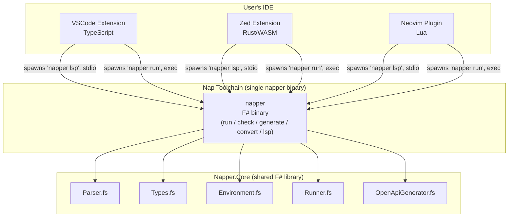
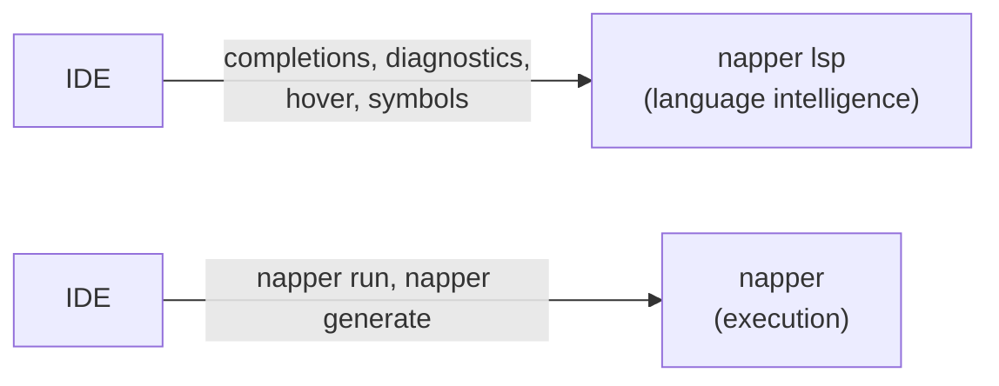
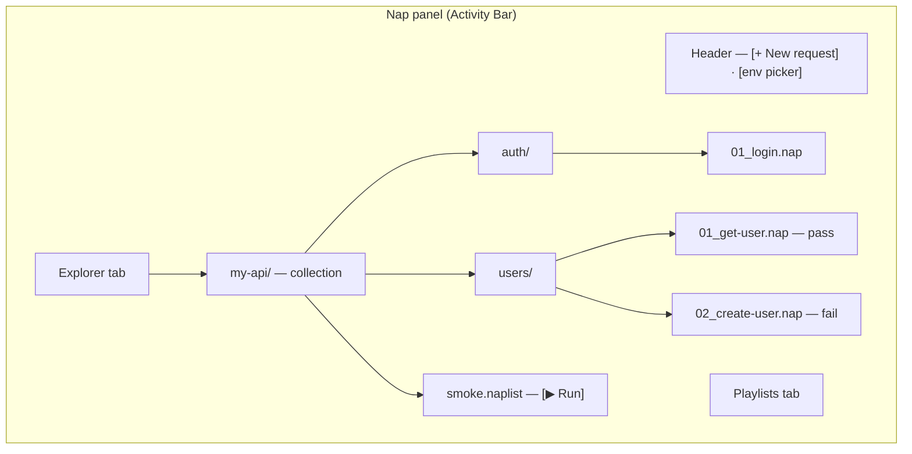
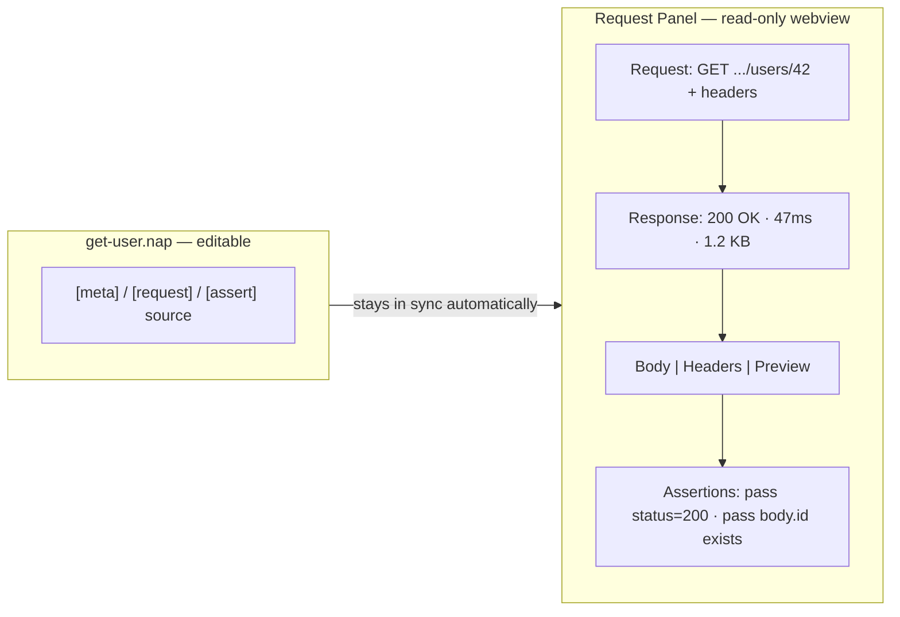

# Napper IDE Extension Specification

> The extension is the **primary entry point** for most users. It must be as approachable as Postman on first open, but backed by plain files that work perfectly from the CLI and in CI.

---

## [IDE-EXTENSION] Overview

All extensions shell out to the **Nap CLI** for execution — no IDE re-implements the HTTP runner — and connect to the **Nap Language Server** ([IDE-LSP]) for language intelligence. This keeps every IDE in sync with the CLI.

## [IDE-TARGETS] Target IDEs

| IDE | Language | Grammar system | Status |
|-----|----------|---------------|--------|
| **VSCode** (+ Cursor, Windsurf, VSCodium) | TypeScript | TextMate | Primary |
| **Zed** | Rust → WASM | Tree-sitter | Primary |
| **Neovim** | Lua | Tree-sitter | Future — not started |

---

## [IDE-ARCHITECTURE] System architecture

---

## [IDE-PHILOSOPHY] Design philosophy

- **No separate app.** Everything lives inside the IDE. No webview-based fake browser.
- **Files are always the truth.** The UI is a lens over `.nap` / `.naplist` files. Edits in either propagate; there is no sync step.
- **Progressive disclosure.** A new user sends their first request within 30 seconds of installing. Scripting, playlists, and environments reveal themselves as the user explores.
- **Looks good, works fast.** Polished UI — not tree views and JSON editors hacked together.
- **Parity where possible.** Features stay as close as possible across IDEs; where an IDE lacks a capability, degrade gracefully rather than omit.

---

## [IDE-LSP] Portable core: the Nap Language Server

The foundation for cross-IDE parity is the **Nap Language Server**, run as the `napper lsp` subcommand. **One binary, one install** ([LSP-ONE-BINARY](./LSP-SPEC.md)). IDE extensions spawn `napper lsp` and speak LSP 3.17 over stdio, reusing `Napper.Core` with zero duplicated logic ([LSP-DEDUP](./LSP-SPEC.md)). Extensions become **thin UI shells** — they render LSP data and handle IDE-specific UI; they do not parse `.nap` files themselves. See [LSP Specification](./LSP-SPEC.md).

---

## [IDE-FEATURE-MATRIX] Feature matrix: what ships where

LSP-backed language features (completions, diagnostics, hover) are **not yet implemented** in the server ([LSP-COMPLETIONS], [LSP-DIAGNOSTICS], [LSP-HOVER](./LSP-SPEC.md)); the rows below mark intent. Symbols, request info, curl, and environments are live ([LSP-SYMBOLS], [LSP-CUSTOM](./LSP-SPEC.md)).

| Feature | VSCode | Zed | Source |
|---------|--------|-----|--------|
| Syntax highlighting | TextMate grammar | Tree-sitter grammar | IDE-specific grammars |
| Document symbols | LSP | LSP | [LSP-SYMBOLS](./LSP-SPEC.md) |
| Request info / Copy as curl / Environments | LSP | LSP | [LSP-CUSTOM](./LSP-SPEC.md) |
| Completions / Diagnostics / Hover | LSP *(planned)* | LSP *(planned)* | [LSP-COMPLETIONS] / [LSP-DIAGNOSTICS] / [LSP-HOVER] |
| Run request | CodeLens `▶ Run` | Runnables (`runnables.scm`) | IDE-specific UI, both shell out to CLI |
| Sidebar panel | Tree view | — | VSCode-only ([VSCODE-LAYOUT]) |
| Response viewer | Webview panel | terminal | VSCode-only ([VSCODE-EDITOR]) |
| Test Explorer | *(planned)* | — | VSCode-only ([VSCODE-TEST-EXPLORER]) |
| Environment switcher UI | Status bar + quick-pick | CLI `--env` | data from LSP |
| New request flow | Quick-input wizard | — | VSCode-only ([VSCODE-NEW-REQUEST]) |
| Commands | Command Palette | Slash commands | IDE-specific entry points |
| AI enrichment (OpenAPI) | VS Code LM API | Zed Assistant | [VSCODE-OPENAPI-AI](./IDE-EXTENION-OPENAPI-GENERATION-SPEC.md) |

---

## Shared behaviour (all IDEs)

### [VSCODE-SYNTAX] Syntax highlighting

Grammar-aware highlighting for `.nap` and `.naplist`. **VSCode:** TextMate grammar (`nap.tmLanguage.json`). **Zed:** Tree-sitter grammar with `highlights.scm`, `brackets.scm`, `outline.scm`, `indents.scm`. Both highlight section headers, keys/values, `{{variable}}` interpolation, HTTP methods, comments, string literals, and assertion operators. Both grammars derive from the same ANTLR `.g4` to prevent drift.

### [VSCODE-CODELENS] Run actions

Every IDE can run a `.nap`/`.naplist` from the editor.

- **VSCode:** CodeLens above relevant lines — `▶ Run` above `[request]`, `▶ Run Playlist` above `[meta]` in `.naplist`, `⧉ Copy as curl` above `[request]`.
- **Zed:** Runnables via `runnables.scm` ([ZED-RUNNABLES]) detect `[request]` blocks and offer "Run" in the gutter; the runnable executes `nap run <file>` and streams output to the terminal.

Language intelligence (completions, diagnostics, hover, symbols) is provided by the LSP — see [LSP Specification](./LSP-SPEC.md).

---

## VSCode-only features

These rely on VSCode APIs with no Zed/Neovim equivalent.

### [VSCODE-LAYOUT] Layout overview

A dedicated **Nap Activity Bar icon** opens a sidebar panel with two tabs:

### [VSCODE-EXPLORER] Explorer tab

Mirrors the on-disk folder structure, filtered to `.nap`, `.naplist`, `.napenv`. Each `.nap` node shows: prettified name, colour-coded HTTP-method badge, last-run result icon (pass/fail/pending/skipped), and a hover with URL, last run time, last status. Context menus: on a `.nap` file — Run, Copy as curl, Open, Add to playlist, Duplicate, Delete; on a folder — Run all, New request here, New playlist here.

### [VSCODE-PLAYLISTS] Playlists tab

Lists all `.naplist` files with a tree of their step structure (including nested playlists). Each playlist node has a Run button; individual steps can be run in isolation.

### [VSCODE-EDITOR] Request editor (split view)

Clicking a `.nap` file opens a split editor: the raw file on the left (editable), a structured **Request Panel** on the right (read-only webview).

The right panel is read-only — a live preview of the request and (after running) the response. Response sub-tabs: **Body** (raw or pretty JSON/XML/text with search), **Headers** (key/value table), **Preview** (rendered HTML or image). The **Assertions** section lists each `[assert]` with pass/fail and actual-vs-expected on failure.

### [VSCODE-ENV-SWITCHER] Environment switcher

A status-bar item (bottom-left) shows the active environment (e.g. `Nap: staging ▾`). Clicking opens a quick-pick of detected environments (from `.napenv.*`). Switching re-resolves all variable previews in open editors. The per-workspace `nap.defaultEnvironment` setting can be committed to set a team default.

### [VSCODE-NEW-REQUEST] New request flow

Clicking **[+]** (or `Nap: New Request`) opens a guided quick-input flow: pick method → enter URL (with `{{variable}}` autocomplete) → pick destination folder → name the request (defaults to `{method} {path}`). The file is created and opened in the split editor, ready to run.

### [VSCODE-TEST-EXPLORER] Test Explorer integration

> **Status: Not implemented.** No `vscode.TestController` is registered yet.

Intended: register a `vscode.TestController` so all `.nap` files appear in the VSCode Test Explorer — collections as suites, `.nap` files as items, `.naplist` files as suites with each step a child, nested playlists as nested suites. Run/debug invokes `nap run <file> --output junit` ([OUTPUT-JUNIT](./CLI-SPEC.md)) and maps results back, showing full request/response, per-assertion actual-vs-expected, and script output.

---

## [VSCODE-SETTINGS] Extension settings

| Setting | Default | Description | IDEs |
|---------|---------|-------------|------|
| `nap.defaultEnvironment` | `""` | Active environment name | All |
| `nap.autoRunOnSave` | `false` | Re-run the request on save | VSCode |
| `nap.splitEditorLayout` | `"beside"` | `"beside"` or `"below"` for the response panel | VSCode |
| `nap.maskSecretsInPreview` | `true` | Mask `.napenv.local` variables in hover | All (via LSP) |
| `nap.cliPath` | `"nap"` | Path to the Nap CLI (auto-detected if on PATH) | All |

## [VSCODE-COMMANDS] Extension commands

**VSCode (Command Palette):** `Nap: New Request`, `New Playlist`, `Run File`, `Run All`, `Switch Environment`, `Copy as curl`, `Generate from OpenAPI`, `Convert .http`, `Reveal in Explorer`.

**Zed (slash commands):** `/nap-run`, `/nap-import-openapi` ([ZED-SLASH-COMMANDS]).

## [VSCODE-IMPL] Implementation notes

- Built in **TypeScript** using the VSCode Extension API. The response-panel webview uses a minimal framework (vanilla TS + CSS) — no heavy UI library.
- The extension shells out to the **Nap CLI** (`nap run --output json`) for all HTTP execution.
- File watching via `vscode.workspace.createFileSystemWatcher` keeps the panel tree current without polling.
- The `.nap` TextMate grammar is generated from the ANTLR grammar to avoid drift.
- Published to the **VS Code Marketplace** and **Open VSX** (VSCodium / Cursor / Windsurf).

### [VSCODE-CLI-ACQUIRE] CLI install resolution

CLI resolution uses `@nimblesite/shipwright-vscode` (`activateDeploymentToolkit`), which reads `shipwright.json` from the extension root. Resolution order (first match wins): user setting → env var → bundled binary → PATH → dotnet tool.

The **bundled binary** (`bin/${platform}/napper[.exe]` inside the installed extension) is the primary path for all Marketplace installs — each per-platform VSIX bundles exactly one binary; the Marketplace delivers the correct VSIX automatically. No runtime download, no .NET SDK on the host. The binary version MUST exactly match `product.version` in `shipwright.json` (= the VSIX `package.json` version); a mismatch is a hard error (`onMismatch: "error"`).

**Canonical reference:** [Shipwright product-repo adoption guide §4](https://github.com/MelbourneDeveloper/deployment_toolkit/blob/main/docs/agents/product-repo-adoption-guide.md). **VSIX packaging:** [SWR-VSIX-PACKAGE] and [SWR-VSIX-PUBLISH] in the [Shipwright VSIX platform bundling spec](https://github.com/MelbourneDeveloper/deployment_toolkit/blob/main/docs/specs/vsix-platform-bundling.md).

---

## Zed-only features

### [ZED-RUNNABLES] Runnables

> **Status: Implemented.** `runnables.scm` detects `[request]` blocks and offers a gutter "Run" that executes `nap run <file>`, streaming output to the Zed terminal.

### [ZED-SLASH-COMMANDS] Slash commands (Assistant)

> **Status: Implemented.** `/nap-run <file>` runs a `.nap` and returns the result in the Assistant; `/nap-import-openapi <file>` generates `.nap` files from an OpenAPI spec.

### [ZED-REDACTIONS] Text redactions

> **Status: Not implemented.** No `redactions.scm` exists yet.

Intended: use `redactions.scm` to mask `{{variable}}` values sourced from `.napenv.local` during screen sharing.

### [ZED-IMPL] Zed implementation notes

Built in **Rust**, compiled to **WebAssembly** via `zed_extension_api`. Tree-sitter grammar for `.nap`/`.naplist`. The extension declares the Nap Language Server in `extension.toml` and implements `language_server_command` to launch `napper lsp`. Published via **zed-industries/extensions**. No webviews, sidebars, or test explorer — Zed users get syntax highlighting, LSP intelligence, runnables, and slash commands.

---

## Related specs

- [LSP Specification](./LSP-SPEC.md) — language-server capabilities, architecture, protocol
- [IDE Extension Plan (VSCode)](../plans/IDE-EXTENSION-PLAN.md) and [Zed Extension Plan](../plans/ZED-EXTENSION-PLAN.md)
- [OpenAPI Generation (Extension)](./IDE-EXTENION-OPENAPI-GENERATION-SPEC.md) — import command and AI enrichment
