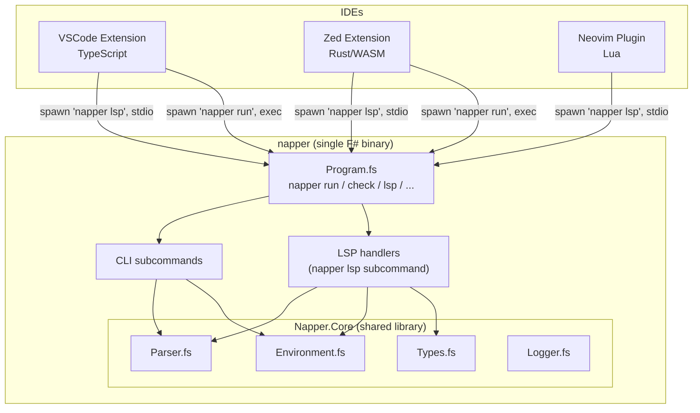

# Nap Language Server — Specification

> The Napper language server is **not a separate binary**. It is a subcommand of the `napper` CLI: `napper lsp` runs the LSP over stdio. **One binary. One install. One version.**

---

## [LSP-ONE-BINARY] One binary

The CLI and the LSP ship as a single `napper` executable. `napper run …` executes a `.nap` file; `napper lsp` starts the language server, reading JSON-RPC from stdin and writing JSON-RPC to stdout. There is no `napper-lsp`, no separate NuGet package, no separate brew formula, no separate version-resolution path. `napper --version` is the version of every capability in the binary, including the LSP.

This is non-negotiable. Splitting the LSP back into its own binary is a regression. The NativeAOT `napper` binary ([CLI-AOT-MIGRATION](./CLI-SPEC.md)) still contains the LSP.

---

## [LSP-ARCHITECTURE] Architecture

---

## [LSP-PRINCIPLES] Design principles

- **One binary.** [LSP-ONE-BINARY]. The LSP is a subcommand of `napper`, not a separate executable.
- **⚠️ ZERO duplicated logic.** LSP handlers MUST NOT contain parsing, types, environment resolution, or any domain logic. Those live in `Napper.Core` and are shared with the CLI. The LSP layer is a thin protocol adapter that calls `Napper.Core` and translates results to LSP responses.
- **`Napper.Core` is the single source of truth.** Any new capability the LSP needs that could be useful to the CLI MUST be added to `Napper.Core`.
- **Protocol-only coupling.** IDE extensions talk to the LSP exclusively via JSON-RPC over stdio. No IDE-specific code in the F# binary.
- **Incremental.** Each capability ships independently; the server advertises only what it supports.

---

## [LSP-TRANSPORT] Transport

| Property | Value |
|----------|-------|
| Launch | `napper lsp` (subcommand) |
| Transport | stdio (stdin/stdout) |
| Protocol | JSON-RPC 2.0 (LSP 3.17) |
| Encoding | UTF-8 |

IDE extensions spawn `napper lsp` as a child process and communicate over stdin/stdout. No TCP, no WebSocket, no HTTP. While `lsp` is active the process MUST NOT print to stdout outside LSP framing, and MUST log to stderr or a file.

---

## [LSP-DEDUP] The LSP replaces duplicated IDE logic

The VSIX historically reimplemented `.nap` parsing in TypeScript. That logic already exists in `Napper.Core`. The LSP eliminates the duplication: all IDEs ask the LSP, the LSP calls `Napper.Core`. **Less TypeScript, less Rust, MORE F#.**

| Duplicated VSIX logic | Replaced by |
|-----------------------|-------------|
| `extractHttpMethod` (TS) | `textDocument/documentSymbol` ([LSP-SYMBOLS]) via `Napper.Core.Parser` |
| `parseMethodAndUrl` (TS) | `napper/requestInfo` ([LSP-CUSTOM]) |
| `parsePlaylistStepPaths` (TS) | `textDocument/documentSymbol` ([LSP-SYMBOLS]) |
| `detectEnvironments` (TS) | `napper/environments` ([LSP-CUSTOM]) |
| CodeLens section detection (TS) | `textDocument/documentSymbol` ([LSP-SYMBOLS]) |

---

## Capabilities

### [LSP-CUSTOM] Custom requests (Napper-specific)

> **Status: Implemented.**

Non-standard LSP requests that provide structured data to all IDEs, replacing duplicated parsing. Each calls a `Napper.Core` function.

| Method | Params | Returns | Replaces |
|--------|--------|---------|----------|
| `napper/requestInfo` | `{ uri }` | `{ method, url, headers }` | `parseMethodAndUrl` (TS) |
| `napper/environments` | `{ rootUri }` | `{ environments[] }` | `detectEnvironments` (TS) |
| `napper/curlCommand` | `{ uri }` | `{ curl }` | curl generation (TS) |

Implemented via `Parser.parseNapFile`, `Environment.detectEnvironmentNames`, and `CurlGenerator.toCurl`.

### [LSP-SYMBOLS] Document symbols

> **Status: Implemented.**

Exposes file structure for outline navigation (Ctrl+Shift+O in VSCode, symbol search in Zed) by walking the parsed AST and emitting `DocumentSymbol` entries with line ranges.

| Symbol | Kind | Scope |
|--------|------|-------|
| `[meta]` | Namespace | `.nap`, `.naplist` |
| `[request]` / `[assert]` / `[script]` | Function | `.nap` |
| `[request.headers]` / `[request.body]` | Struct | `.nap` |
| `[vars]` | Variable | `.nap`, `.naplist` |
| `[steps]` | Array | `.naplist` |

### [LSP-COMPLETIONS] Completions

> **Status: Not implemented.** No completion provider is advertised in `Server.fs` capabilities; `textDocument/completion` is not handled.

Intended: context-aware completions triggered inside `.nap` / `.naplist` files — HTTP methods after `method =`, common headers in `[request.headers]`, variable names inside `{{`, status codes and assertion operators in `[assert]`, and step paths in `[steps]`. Implementation parses up to the cursor via `Napper.Core.Parser` and offers items for the current section.

### [LSP-DIAGNOSTICS] Diagnostics

> **Status: Not implemented.** No diagnostics are published on `didOpen`/`didChange`.

Intended: parse errors, unknown `{{variable}}` references, missing `[request]` block, invalid assertion syntax, unreachable script paths, and missing step files — published with line/column positions from FParsec error info.

### [LSP-HOVER] Hover

> **Status: Not implemented.** No hover provider is advertised.

Intended: resolved value for `{{variable}}` (masked for `.napenv.local`), section descriptions, HTTP-method descriptions, and assertion-operator descriptions.

---

## [LSP-FILE-WATCHING] File watching

> **Status: Not implemented.** No `workspace/didChangeWatchedFiles` registration exists.

Intended: watch `**/.napenv` and `**/.napenv.*`; on change, reload via `Environment.loadEnvironment`, re-publish [LSP-DIAGNOSTICS], and refresh [LSP-HOVER] resolution.

---

## [LSP-CONFIGURATION] Configuration

> **Status: Not implemented.** `workspace/didChangeConfiguration` and `initializationOptions` are not consumed.

Intended settings:

| Setting | Type | Default | Description |
|---------|------|---------|-------------|
| `nap.environment` | string | `""` | Active environment (selects `.napenv.{name}`) |
| `nap.maskSecrets` | bool | `true` | Mask `.napenv.local` values in [LSP-HOVER] |

---

## [LSP-FILE-TYPES] Supported file types

> **Status: Partial.** `.nap` and `.naplist` are recognized; `.napenv` hover semantics depend on the unimplemented [LSP-HOVER].

| Extension | Language ID | Features |
|-----------|------------|----------|
| `.nap` | `nap` | [LSP-SYMBOLS], [LSP-CUSTOM] (and, when implemented, completions/diagnostics/hover) |
| `.naplist` | `naplist` | [LSP-SYMBOLS] |
| `.napenv` | `napenv` | [LSP-HOVER] (planned) |

---

## [LSP-ERROR-HANDLING] Error handling

> **Status: Implemented.**

- The server never crashes on malformed input — all handlers catch exceptions and log via `Napper.Core.Logger`.
- Null-safe JSON access and lenient framing tolerate partial/garbage input.
- With no `.napenv` files present, variable-related features degrade gracefully (no values, but no errors).

When [LSP-DIAGNOSTICS] lands, FParsec parse errors will map to LSP `Diagnostic` objects with precise positions.

---

## [LSP-DISTRIBUTION] Distribution

> **Status: Implemented.**

The LSP has no separate distribution — it ships inside the native `napper` binary and launches via `napper lsp`. The primary channels need no .NET ([CLI-AOT-MIGRATION](./CLI-SPEC.md)): install script ([CLI-INSTALL-SCRIPT](./CLI-SPEC.md)), Homebrew ([CLI-INSTALL-HOMEBREW](./CLI-SPEC.md)), Scoop ([CLI-INSTALL-SCOOP](./CLI-SPEC.md)), and the optional dotnet tool ([CLI-INSTALL-DOTNET-TOOL](./CLI-SPEC.md)). The VSIX resolver ([VSCODE-CLI-ACQUIRE](./IDE-EXTENSION-SPEC.md)) installs `napper` once — that install gives the LSP for free.

---

## [LSP-DISCOVERY] Discovery

> **Status: Implemented.**

IDE extensions launch the server by spawning `<resolved-napper-path> lsp`. The resolved path is whatever the install resolver settled on. There is no separate `nap-lsp` lookup — the LSP is reachable iff the CLI is reachable.

---

## Related specs

- [CLI Spec](./CLI-SPEC.md) — `napper` subcommands including `napper lsp`
- [IDE Extension Spec](./IDE-EXTENSION-SPEC.md) — feature matrix and IDE-specific behaviour
- [File Formats Spec](./FILE-FORMATS-SPEC.md) — `.nap`, `.naplist`, `.napenv` definitions
- [LSP Implementation Plan](../plans/LSP-PLAN.md) — phases and TODO
